# README assets

Custom SVGs for the GitHub profile. GitHub does not run JavaScript in READMEs, so every motion uses SMIL inside these files.

| File | Role |
| --- | --- |
| `assets/boot.svg` | Boot sequence, loading bar, scan line, name reveal |
| `assets/terminal-rain.svg` | Falling developer commands |
| `assets/typing-code.svg` | Line-by-line `Developer` class, then BUILD SUCCESSFUL |
| `assets/code-tree.svg` | Code falling into circuit roots and a glowing tree |
| `assets/fireflies.svg` | Slow sage/white particles |
| `assets/shutdown.svg` | Session exit, still ONLINE |
| `assets/identity.svg` | Name, roles, VIT, CGPA, LeetCode |
| `assets/tech-network.svg` | Connected TECH DNA nodes |
| `assets/achievements.svg` | Unlocked nodes and next cycle |
| `assets/live-status.svg` | Live terminal status |
| `assets/contribution-rain.svg` | commit / push / grow rain |
| `assets/footer-forest.svg` | Living forest + philosophy line |
| `assets/rootline.svg` | Thin section transition |

## How they render

Reference them from `README.md` with relative paths:

```html

```

Do not inline SVG markup in the README. GitHub strips most inline SVG animation.

## After cloning to the profile repo

1. Copy this folder into `prachi-ankush-3/prachi-ankush-3`.
2. Push to `main` or `master`.
3. Run **Actions → contribution trail** once so the snake is written to the `output` branch.
4. Replace placeholder project and LeetCode / HackerRank URLs in `README.md` when they exist.

Palette used in every asset:

`#0D1117` `#11160F` `#1B2117` `#263021` `#3D4432` `#58634A` `#72805F` `#95A27D` `#B8C4A3` `#FFFFFF`
