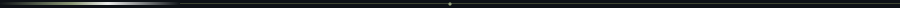
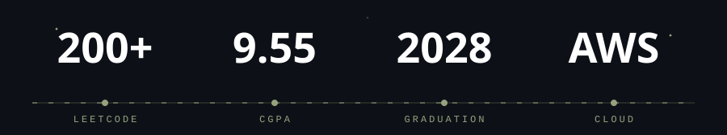
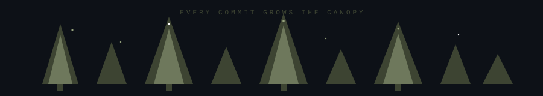
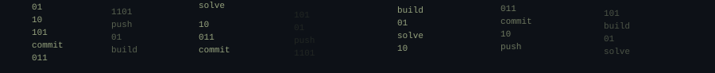
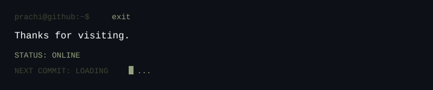

<div align="center">
  
</div>

<br/>

<div align="center">
  
</div>

<br/>

<div align="center">
  <h1>PRACHI ANKUSH</h1>

  <p>
    COMPUTER ENGINEER<br/>
    DEVELOPER · BUILDER · PROBLEM SOLVER
  </p>

  
</div>

<br/>

<div align="center">
  <em>Turning ideas into software, one commit at a time.</em>
</div>

<br/>

<div align="center">
  
</div>

<br/>

<div align="center">
  <code>whoami</code>
</div>

<div align="center">
  
</div>

<br/>

<div align="center">
  
</div>

<br/>

<div align="center">
  <code>signal</code>
</div>

<div align="center">
  
</div>

<br/>

<div align="center">
  
</div>

<br/>

<div align="center">
  <code>TECH DNA</code>
</div>

<br/>

<div align="center">
  <sub>LANGUAGES</sub><br/>
  <br/>
  <br/>
  <sub>BUILD</sub><br/>
  <br/>
  <br/>
  <sub>CREATE</sub><br/>
  <br/>
  <sub>OpenCV · MediaPipe · TensorFlow</sub><br/>
  <br/>
  <sub>CONNECT</sub><br/>
  
</div>

<br/>

<div align="center">
  <sub>DSA · OOP · DBMS · OS · CN · SE</sub>
</div>

<br/>

<div align="center">
  
</div>

<br/>

<div align="center">
  <code>BUILD LOG</code>
</div>

```
●  2026
│
├──  EngiSummary
│    Engineering Drawing Intelligence
│    React · Python · AI
│    STATUS: BUILDING
│
●
│
├──  TravAgent
│    AI Travel & Bus Assistant
│    Python · React
│
●
│
├──  HandTalk
│    Sign Language → Text + Speech
│    Python · OpenCV · MediaPipe
│    SPRINGER · SCOPUS
│
●
│
└──  TaskPro
     Smart Team Collaboration
     PHP · MySQL · JavaScript
```

<p>
  <a href="https://github.com/prachi-ankush-3/EngiSummary">VIEW → EngiSummary</a>
  &nbsp;·&nbsp;
  <a href="https://github.com/prachi-ankush-3/TravAgent">VIEW → TravAgent</a>
  &nbsp;·&nbsp;
  <a href="https://github.com/prachi-ankush-3/HandTalk">VIEW → HandTalk</a>
  &nbsp;·&nbsp;
  <a href="https://github.com/prachi-ankush-3/TaskPro">VIEW → TaskPro</a>
</p>

<br/>

<div align="center">
  
</div>

<br/>

<div align="center">
  <code>ACHIEVEMENT SYSTEM</code>
</div>

<div align="center">
  
</div>

<br/>

<div align="center">
  
</div>

<br/>

<div align="center">
  <code>CONTRIBUTION FOREST</code>
  <br/>
  <sub>every contribution grows the forest</sub>
</div>

<div align="center">
  
</div>

<div align="center">
  
</div>

<div align="center">
  
</div>

<br/>

<div align="center">
  <code>CODE IN MOTION</code>
</div>

<div align="center">
  
</div>

<br/>

<div align="center">
  <code>DEVELOPER TELEMETRY</code>
</div>

<div align="center">
  
  
  
</div>

<br/>

<div align="center">
  
</div>

<br/>

<div align="center">
  <code>LIVE DEVELOPMENT</code>
</div>

<div align="center">
  
</div>

<br/>

<div align="center">
  <code>CONTRIBUTION TRAIL</code>
  <br/>
  <sub>Code → Commit → Contribute → Repeat.</sub>
</div>

<div align="center">
  <picture>
    <source media="(prefers-color-scheme: dark)" srcset="https://raw.githubusercontent.com/prachi-ankush-3/prachi-ankush-3/output/github-contribution-grid-snake.svg" />
    
  </picture>
</div>

<br/>

<div align="center">
  <code>PATH</code>
</div>

<div align="center">
  
</div>

<br/>

<div align="center">
  
</div>

<br/>

<div align="center">
  
</div>

<br/>

<div align="center">
  <a href="https://github.com/prachi-ankush-3"></a>
  &nbsp;&nbsp;&nbsp;
  <a href="https://www.linkedin.com/in/prachiankush/"></a>
  &nbsp;&nbsp;&nbsp;
  <a href="https://leetcode.com/prachiankush/"></a>
  &nbsp;&nbsp;&nbsp;
  <a href="https://www.hackerrank.com/prachiankush3"></a>
  &nbsp;&nbsp;&nbsp;
  <a href="mailto:prachiankush3@gmail.com"></a>
</div>

<br/>

<div align="center">
  
</div>
