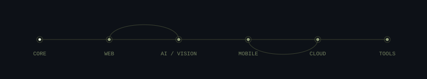
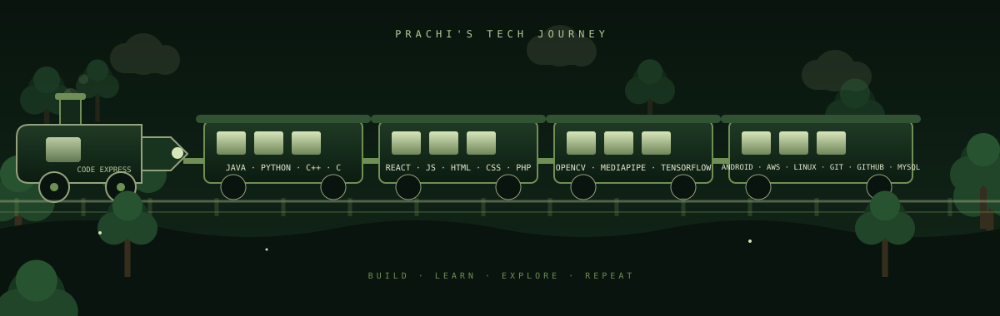
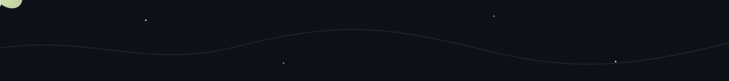
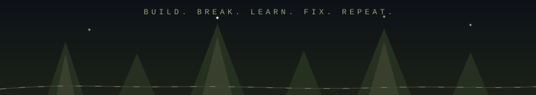

  

  

  

  

  

  

  

  

  

  

  

  

  

  

  

  <picture>
    <source media="(prefers-color-scheme: dark)" srcset="https://raw.githubusercontent.com/prachi-ankush-3/prachi-ankush-3/output/github-contribution-grid-snake.svg" />
    
  </picture>

  

  

  

  

  
  &nbsp;&nbsp;&nbsp;
  
  &nbsp;&nbsp;&nbsp;
  
  &nbsp;&nbsp;&nbsp;
  
  &nbsp;&nbsp;&nbsp;
  

  

